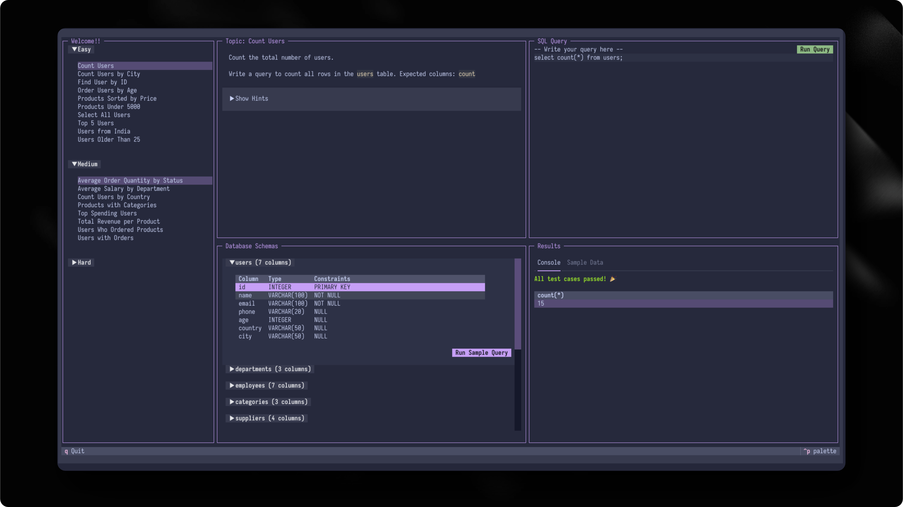

<!-- markdownlint-disable MD010 MD036 MD041 -->

[](#)

[](https://www.python.org/)
[](https://textual.textualize.io/)
[](#)
[](#)

> A simple SQL practicing TUI built using Python and Textual

## Table of Contents

- [About](#about)
- [Features](#features)
- [Installation](#installation)
- [Usage](#usage)
- [Screenshots](#screenshots)
- [Project Structure](#project-structure)
- [Testing](#testing)
- [Tech Stack](#tech-stack)
- [License](#license)

---

## About

**squilio** is an interactive Terminal User Interface (TUI) application for practicing SQL queries. It provides a hands-on environment where users can write and execute SQL queries against a real SQLite database while following structured practice questions organized by difficulty levels.

Whether you're a beginner learning SQL basics or an advanced user practicing complex queries, squilio offers a guided learning experience with instant feedback through built-in test cases.

---

## Features

### 📝 Interactive SQL Editor
- Write SQL queries with syntax highlighting
- Execute queries with a single click
- View results in a formatted table


### 📚 Question-Based Learning
- **3 Difficulty Levels**: Easy, Medium, Hard
- **21+ Practice Questions** covering:
  - Basic SELECT queries
  - Filtering and sorting
  - JOIN operations
  - Aggregations (COUNT, SUM, AVG)
  - Subqueries
  - Data modification (INSERT, UPDATE, DELETE)

### ✅ Query Validation
- Automated test case validation
- Instant feedback on query correctness
- Reference queries for learning

### 🎨 Beautiful Terminal UI
- Clean, modern TUI interface
- Tabbed results view (Console + Sample Data)
- Responsive grid layout

---

## Installation

### Prerequisites

- Python 3.13 or higher
- pip or uv package manager

### Install via pip

```bash
pip install squilio
```

### Install via uv

```bash
uv tool install squilio
```

### Install from source

```bash
git clone https://github.com/yourusername/squilio.git
cd squilio
pip install -e .
```

---

## Usage

### Running the Application

After installation, simply run:

```bash
squilio
```

Or:

```bash
python -m squilio
```

### Application Controls

| Key | Action |
|-----|--------|
| `q` | Quit the application |
| Click | Select questions, run queries |
| Collapsibles | Expand/collapse sections |

### How to Use

1. **Select a Question** - Browse questions by difficulty in the sidebar
2. **Read the Problem** - View the description and hints in the topic panel
3. **Write Your Query** - Type your SQL in the editor
4. **Run Query** - Click "Run Query" to execute
5. **View Results** - See output in the console tab
6. **Check Test Cases** - Validation results appear below results

---

## Screenshots

<!-- Add your screenshots here -->




---

## Project Structure

```
squilio/
├── app/
│   ├── main.py              # Application entry point
│   ├── constant.py          # Configuration constants
│   ├── styles.py            # TUI CSS styles
│   ├── utils.py            # Utility functions
│   ├── components/          # UI components
│   │   ├── sidebar.py      # Question list sidebar
│   │   ├── topics.py       # Problem description panel
│   │   ├── sql.py          # SQL editor panel
│   │   ├── schema.py       # Schema viewer panel
│   │   └── console.py      # Results console panel
│   ├── db/                 # Database utilities
│   │   ├── engin.py       # DB session management
│   │   ├── utils.py       # DB query functions
│   │   ├── seed.py        # DB seeding
│   │   └── sql/           # SQL schema & data files
│   └── questions/          # Question system
│       ├── schema.py       # Question data models
│       ├── registry.py     # Question registration
│       ├── runner.py       # Query validation
│       ├── easy/          # Easy questions
│       ├── medium/        # Medium questions
│       └── hard/          # Hard questions
├── tests/                  # Test suite (64 tests)
└── pyproject.toml         # Project configuration
```

---

## Testing

Run the test suite with:

```bash
pytest tests/
```

Run with coverage:

```bash
pytest tests/ --cov=app --cov-report=html
```

### Test Coverage

- Database operations (SELECT, INSERT, UPDATE, DELETE)
- Query validation
- Schema loading
- Constraint enforcement
- Integration tests

---

## Tech Stack

| Technology | Purpose |
|------------|---------|
| [Python 3.13+](https://www.python.org/) | Programming language |
| [Textual](https://textual.textualize.io/) | TUI framework |
| [SQLite](https://www.sqlite.org/) | Database |
| [pytest](https://pytest.org/) | Testing framework |

---

## License

This project is licensed under the MIT License - see the [LICENSE](LICENSE) file for details.

---

## Acknowledgments

- [Textual](https://textual.textualize.io/) - For the amazing TUI framework
- [Python Community](https://www.python.org/community/) - For continuous support

---

<!-- markdownlint-enable MD010 MD036 MD041 -->
